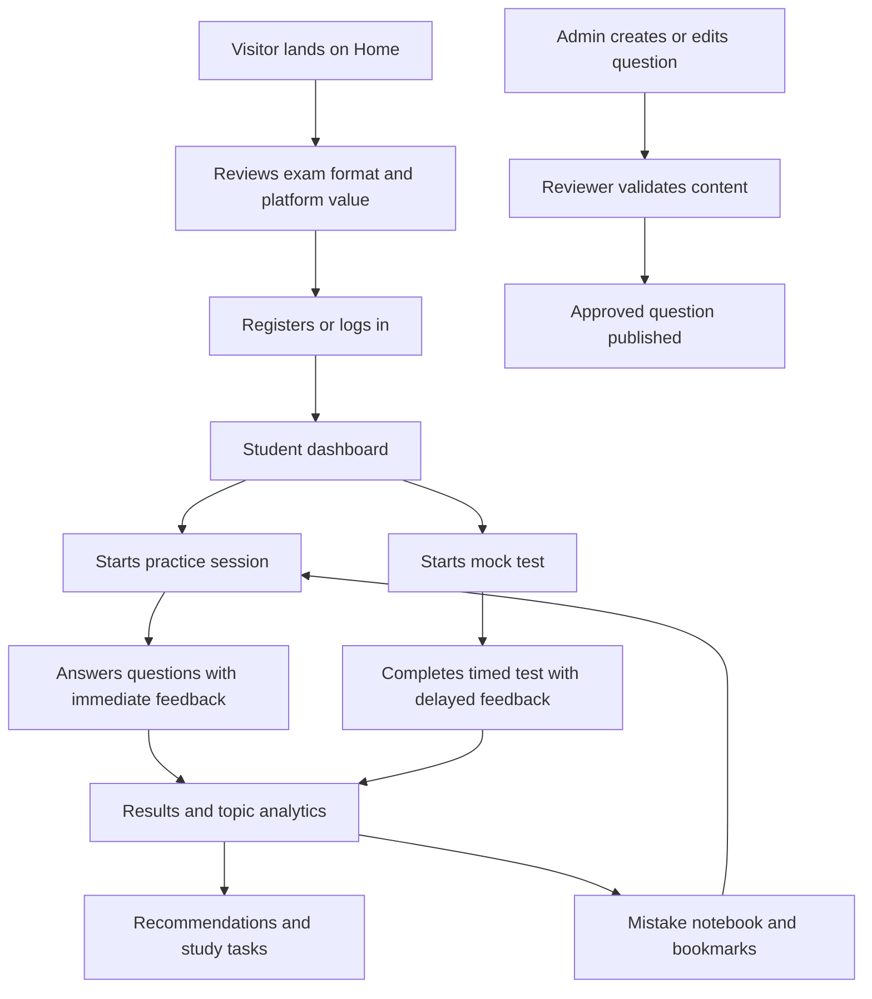

## 1. Product Overview
dMAT Prep is a production-ready independent preparation platform for students preparing for the Digital Master Test Core Module.
- It helps students understand the exam format, practice realistic question types, take timed tests, review performance, and improve weak areas with data-informed recommendations.
- It positions itself as a serious, analytics-driven educational product with a clear independence disclaimer and no claimed affiliation with official dMAT authorities.

## 2. Core Features

### 2.1 User Roles
| Role | Registration Method | Core Permissions |
|------|---------------------|------------------|
| Student | Email and password via Supabase Auth | Practice questions, take mock tests, bookmark items, review mistakes, view analytics, manage profile |
| Reviewer | Admin invitation and role assignment | Review drafted questions, validate answers and explanations, approve, reject, or request changes |
| Admin | Admin invitation and role assignment | Manage questions, tests, reports, users, analytics, subscriptions, and audit records |

### 2.2 Feature Module
1. **Home**: hero, platform overview, exam overview, feature highlights, pricing preview, FAQ, disclaimer, diagnostic CTA
2. **Exam Format**: Core Module structure and question-type overview
3. **Practice**: configurable practice sessions by module, topic, difficulty, timing mode, source filter
4. **Mock Tests**: realistic timed tests, section instructions, attempt start flow, full-screen focus mode
5. **Dashboard**: student summary, recent attempts, recommendations, weak topics, upcoming study tasks
6. **Results**: post-practice and post-test performance review, breakdowns, explanations, next-step guidance
7. **Mistake Notebook**: incorrect questions, personal notes, reattempt flow, understood-state management
8. **Bookmarks**: saved questions and filtered review workflow
9. **Profile**: account settings, exam target details, preferences, subscription overview
10. **Pricing**: free versus premium benefits, mock test access, plan comparison
11. **Authentication**: login, register, forgot password, reset password, email verification
12. **Admin Dashboard**: question operations, review queue, reports, user management, audit visibility
13. **Question Creator**: dynamic question-authoring form for all supported question types
14. **Test Builder**: test construction, section setup, randomization settings, publication controls
15. **Question Review Queue**: reviewer workflow for validation and approval decisions

### 2.3 Page Details
| Page Name | Module Name | Feature description |
|-----------|-------------|---------------------|
| Home | Hero section | “Prepare Smarter for the dMAT” headline, serious educational tone, diagnostic CTA |
| Home | Overview sections | Exam format summary and Core Module overview |
| Home | Feature preview | Practice modes, mock tests, analytics, sample question preview, pricing preview, FAQ |
| Home | Disclaimer | Show independent-platform disclaimer prominently in footer and supporting sections |
| Exam Format | Structure overview | Explain Core Module sections and supported question types |
| Practice | Session setup | Configure module, type, topic, difficulty, quantity, timing, and source filters |
| Mock Tests | Test catalog | Show available mini tests and full mocks with duration, sections, and access tier |
| Dashboard | Summary cards | Accuracy, attempts, time spent, weak topics, recommended next actions |
| Results | Analytics review | Score, timing, difficulty and topic performance, review-by-question |
| Mistake Notebook | Error review | Store incorrect questions, notes, repeated patterns, and reattempt actions |
| Bookmarks | Saved content | Filter and resume saved questions |
| Profile | User settings | Manage personal profile, password, preferences, and study settings |
| Pricing | Plan comparison | Free and premium access explanation with clear feature boundaries |
| Login/Register | Auth forms | Secure, accessible Supabase Auth forms with validation and status states |
| Admin Dashboard | Operations hub | Metrics, queue counts, reports, publishing controls, user and question oversight |
| Question Creator | Dynamic authoring | Conditional fields for question type, validation, preview, draft and review actions |
| Test Builder | Assembly tools | Build sections, select questions, define order and randomization, publish state |
| Question Review Queue | Review workflow | Reviewer actions, feedback, approval or rejection with audit tracking |

## 3. Core Process
Students land on the home page, understand the exam format, create an account, and then use either practice mode or mock tests depending on their preparation goals. Practice sessions emphasize feedback and learning, while mock tests emphasize realistic timing and delayed review. Results feed analytics, recommendations, bookmarks, and the mistake notebook. Admins and reviewers manage question quality through structured creation, validation, approval, and publication workflows.

## 4. User Interface Design
### 4.1 Design Style
- Primary colors: white, soft grey, deep blue, and indigo accents
- Button style: medium-rounded, structured, professional controls with high contrast
- Fonts and sizes: large readable headings, clear body text, strong hierarchy for test interfaces
- Layout style: desktop-first, editorial educational layout with disciplined spacing and restrained motion
- Icon style suggestions: minimal outline icons, functional rather than playful, consistent use of accessible status cues

### 4.2 Page Design Overview
| Page Name | Module Name | UI Elements |
|-----------|-------------|-------------|
| Home | Hero | Large headline, explanatory subheading, CTA buttons, clean illustration or visual module preview |
| Home | Feature sections | Neutral cards, subtle borders, blue highlights, serious academic tone |
| Exam Format | Module explainer | Sectioned content, diagrams, tables, time and structure callouts |
| Practice | Configuration panel | Sidebar filters, structured cards, radio groups, clear timed-mode toggles |
| Mock Tests | Test interface | Focused top bar, clear timer, serious question layout, accessible navigator states |
| Dashboard | Analytics summary | Metric cards, trend charts, recommendation panel, empty and loading states |
| Results | Review area | Accuracy charts, timing analysis, expandable explanations, comparison blocks |
| Admin | Management workspace | Data table layouts, filters, status badges, review actions, audit visibility |

### 4.3 Responsiveness
- Desktop-first design for test-taking and administration
- Mobile-adaptive layouts for marketing, dashboard, profile, and lighter review flows
- Practice and test screens prioritize wide layouts, large touch-safe controls, and keyboard accessibility
- All status indicators must combine text, iconography, and color for accessibility

### 4.4 Product Constraints
- Include the disclaimer on the home page and relevant marketing/footer areas: “dMAT Prep is an independent preparation platform and is not affiliated with or endorsed by the official dMAT examination authorities.”
- The test experience must feel focused and credible, not gamified
- The MVP excludes live classes, forums, native mobile apps, and heavy gamification
