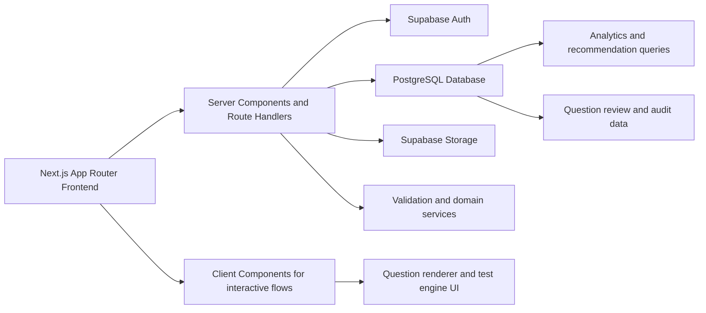
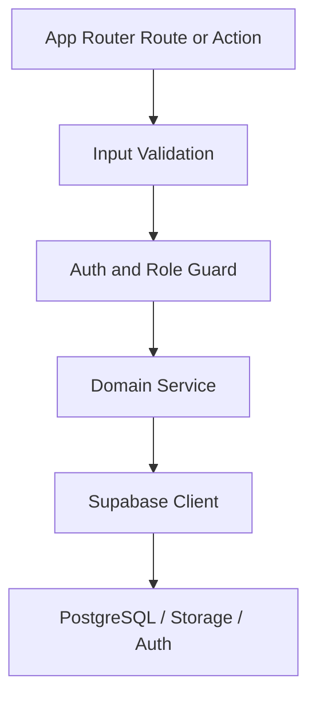
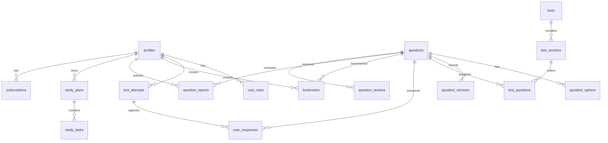

## 1. Architecture Design


## 2. Technology Description
- Frontend: Next.js App Router + React + TypeScript strict mode + Tailwind CSS + shadcn/ui
- Forms and validation: React Hook Form + Zod
- Backend pattern: Next.js server actions and route handlers for secure server-side operations
- Data: Supabase PostgreSQL with JSONB for polymorphic question structures
- Authentication: Supabase Auth with role-aware app authorization
- Storage: Supabase Storage for supporting assets and future imports
- Charts: Recharts
- Deployment: Vercel

## 3. Route Definitions
| Route | Purpose |
|-------|---------|
| / | Home page and platform overview |
| /exam-format | Explain exam format, modules, and supported question types |
| /practice | Configure and run practice sessions |
| /tests | Browse mini tests and mock tests |
| /results | Review completed practice and test results |
| /dashboard | Student dashboard with analytics and recommendations |
| /mistakes | Mistake notebook and reattempt workflow |
| /bookmarks | Saved questions |
| /profile | User profile and study preferences |
| /pricing | Subscription and access overview |
| /login | Sign-in page |
| /register | Sign-up page |
| /forgot-password | Password reset request |
| /reset-password | Password reset completion |
| /admin | Admin dashboard |
| /admin/questions/new | Question creator |
| /admin/tests/new | Test builder |
| /admin/review | Question review queue |

## 4. API Definitions
### 4.1 Shared Domain Types
```ts
export type UserRole = "student" | "reviewer" | "admin";

export type QuestionType =
  | "figure_sequence"
  | "mathematical_equation"
  | "latin_square"
  | "computer_science";

export type ModuleType = "core" | "computer_science";

export type Question = {
  id: string;
  module: ModuleType;
  questionType: QuestionType;
  subject?: string;
  topic: string;
  subtopic?: string;
  difficulty: "easy" | "medium" | "hard";
  questionText: string;
  passage?: string;
  code?: string;
  formula?: string;
  tableData?: unknown;
  diagramData?: unknown;
  imageUrl?: string;
  options: QuestionOption[];
  correctOptionId: string;
  explanation: string;
  estimatedTimeSeconds: number;
  sourceType: "manual" | "generated" | "imported";
  verificationStatus: "draft" | "under_review" | "approved" | "rejected";
  publicationStatus: "draft" | "published" | "flagged" | "retired";
  version: number;
  createdAt: string;
  updatedAt: string;
};

export type QuestionOption = {
  id: string;
  label: string;
  content: string;
  metadata?: Record<string, unknown>;
};
```

### 4.2 Phase 1 Server Surfaces
| Surface | Purpose |
|---------|---------|
| Supabase browser client | Authenticated client access for safe public operations |
| Supabase server client | Secure server-side data access and session evaluation |
| Auth middleware | Protected route checks and role-aware redirects |
| Validation layer | Parse env values, forms, and database payloads using Zod |

## 5. Server Architecture Diagram


## 6. Data Model
### 6.1 Data Model Definition


### 6.2 Database Table Plan
| Table | Purpose | Notes |
|-------|---------|-------|
| profiles | User profile metadata keyed to auth user | Stores display and study-related metadata |
| user_roles | Role assignments | Supports student, reviewer, admin |
| questions | Canonical question record | JSONB for type-specific structures |
| question_options | Question answer options | Exactly four active options per question |
| question_versions | Immutable change history | Used for review and auditability |
| tests | Mock test or mini test metadata | Free or premium visibility, publication state |
| test_sections | Timed test sections | Duration and ordering controls |
| test_questions | Mapping between sections and questions | Randomization and ordering flags |
| test_attempts | User attempt state | Timing, submission, and restoration support |
| user_responses | Per-question response records | Answer, time spent, review flag, status |
| bookmarks | Saved questions | Unique per user-question pair |
| question_reports | Student issue reports | Drives review queues |
| user_topic_performance | Aggregated performance snapshots | Supports recommendations and analytics |
| study_plans | Daily or weekly recommendation bundles | Rule-based study guidance |
| study_tasks | Individual actionable tasks | Generated from recommendation rules |
| question_reviews | Reviewer decisions and comments | Approval workflow state |
| subscriptions | Premium access tracking | Plan, status, period windows |
| audit_logs | Sensitive administrative event log | Supports traceability and review |

### 6.3 Data Definition Language
Phase 1 will create initial Supabase SQL migrations for all required tables, indexes, triggers, and Row Level Security policies. The first migration set will include:
- shared timestamp trigger function and `updated_at` triggers
- enum types for roles, modules, question types, verification status, publication status, difficulty, report reason, and subscription status where useful
- `profiles` bootstrap synchronized with Supabase Auth users
- all required tables with primary keys, foreign keys, and practical indexes
- grants and RLS policies for `anon` and `authenticated`
- role-based access patterns for students, reviewers, and admins

## 7. Phase 1 Architecture Decisions
- Keep business logic in `src/lib`, not inside page components
- Keep question rendering independent from practice or test session orchestration
- Use server components by default and client components only for interactive interfaces
- Use typed schema modules for environment variables, auth context, and database records
- Prepare the codebase for Vercel deployment without exposing service-role credentials to the browser
